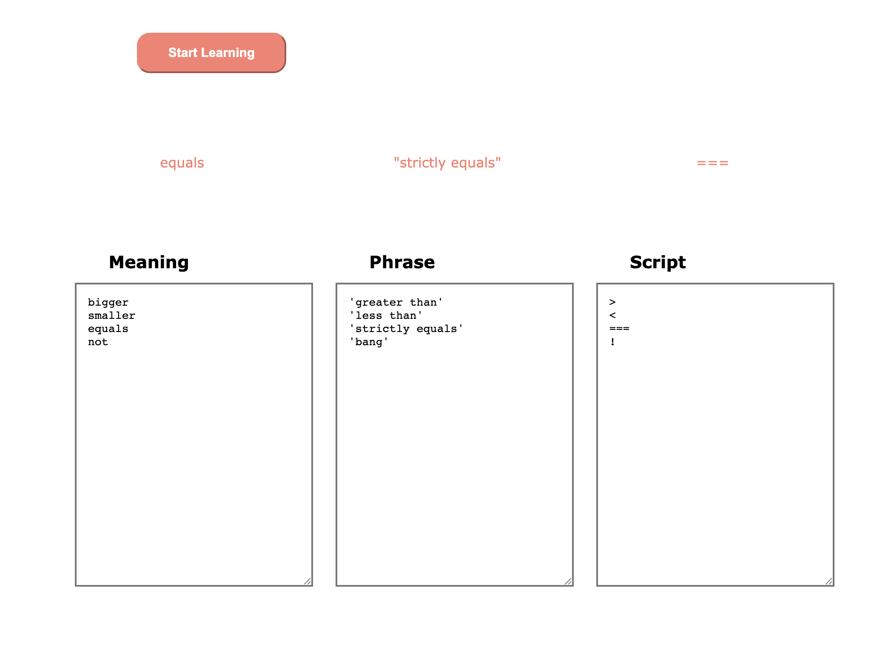

# Custom Language Learning

# Description
paste in your english meaning, foreign phrase and script, and begin to study foreign words and phrases flashcard style on an infinite loop.

# Versions

## V1.0
- this code takes in 3 pasted inputs, then enables the start button, and splits them by line break into an array to loop through, each set is displayed for 5 seconds (phrase and script together, delayed after meaning), then loops back to the beginning of the array when finished.
 