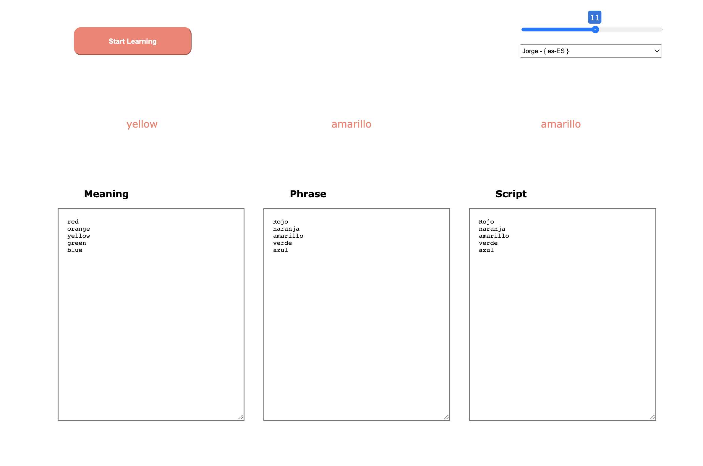
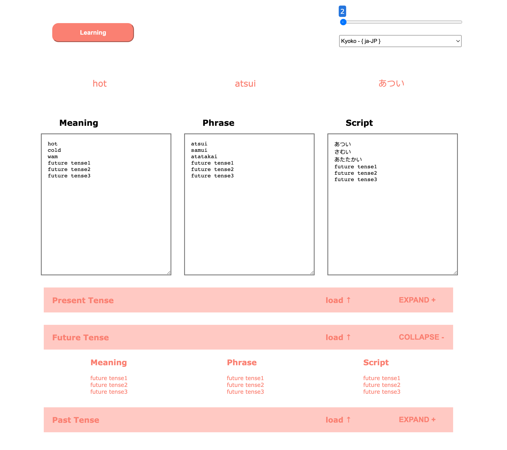

# Custom Language Learning
## Author: [H-Griffin](https://github.com/h-griffin)

# Description
paste in your english meaning, foreign phrase and script, and begin to study foreign words and phrases flashcard style on an infinite loop.

# Table Of Contents

## [V1.0 - AUG 2022](https://github.com/h-griffin/custom-language-learning/tree/v1)
### Features
- conditional start button
- phrase and script delayed from meaning
- infinite loop
### Description
- This code takes in 3 pasted inputs, then enables the start button, and splits them by line break into an array to loop through. Each set is displayed for 5 seconds (phrase and script together, delayed after meaning), then loops back to the beginning of the array when finished.
> 

## [V2.0 - SEPT 2022](https://github.com/h-griffin/custom-language-learning/tree/v2)
### New Features 
- text-to-speech audio
- delay time slider control
- text animation/fade in
- pause
### Description
- this code takes in the delay timer value and starts the interval cycle, if the delay time is changed while the interval cycle is running, it will stop the current interval and create a new one with the new speed/delay time value
- "meaning" will be read out in english, and "script" is read out by the foreign speech object, which can be changed in the dropdown to update its voice and language **(for best results, match the selected speech language with the same language the phrase and script are written in)**
> 

## [V3.0 - SEPT 2022](https://github.com/h-griffin/custom-language-learning/tree/v2)
### New Features 
- pre-loaded past present and future tense words
### Description
- this code adds accordion modules of past present and future tense words that will load selected module appending to the end of the text area 
> 