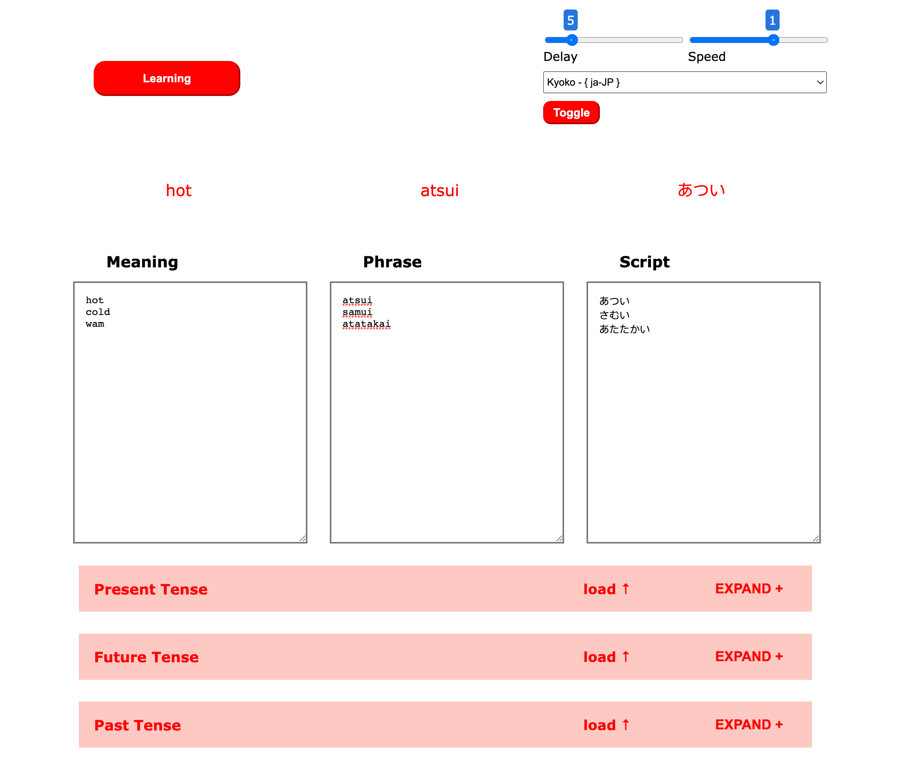
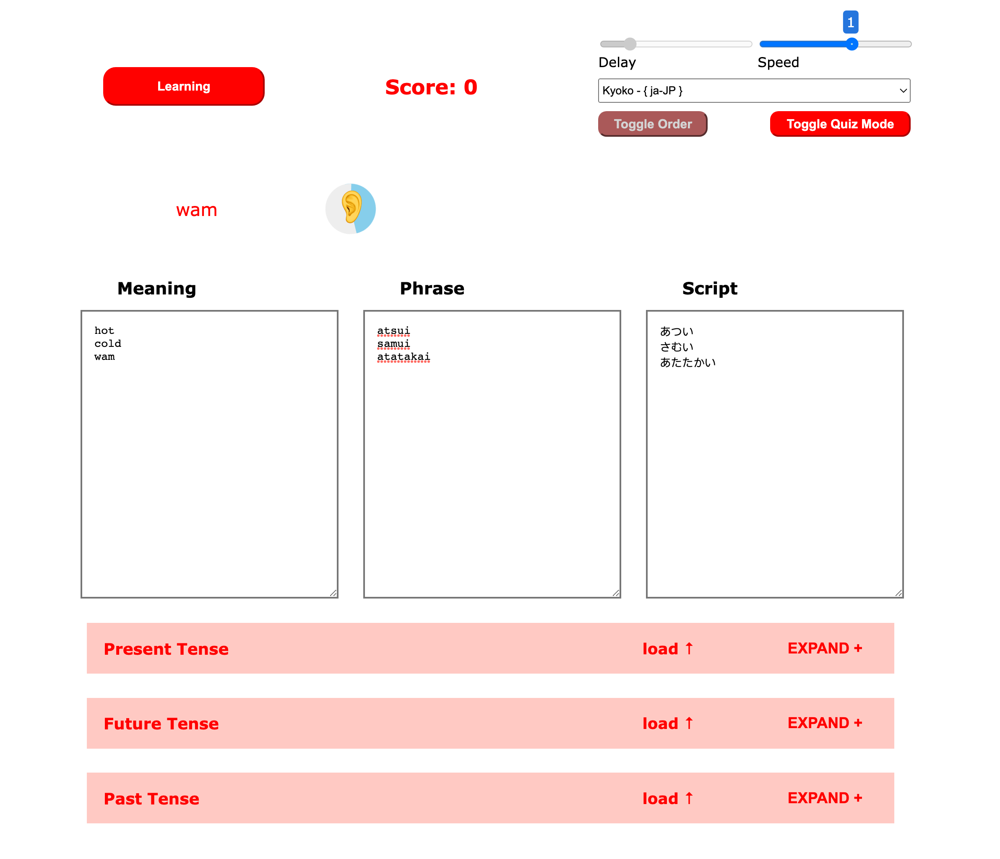
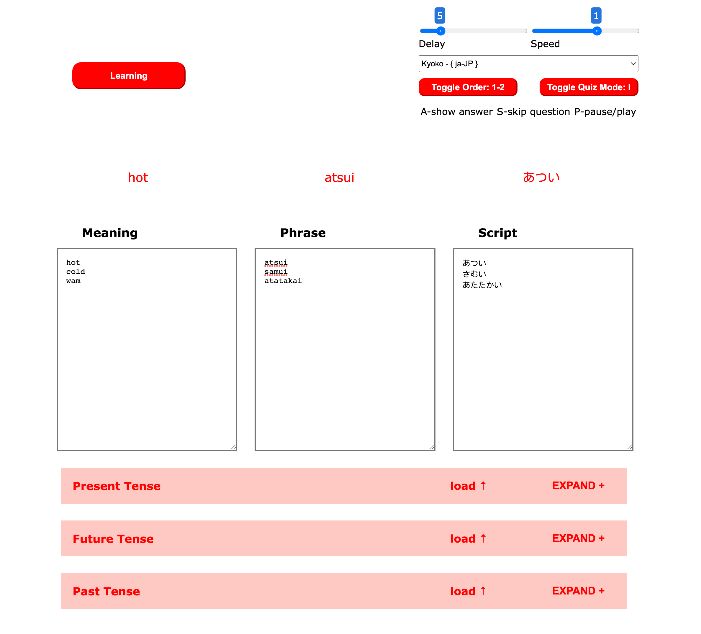

# Custom Language Learning 6.0
## Author: [H-Griffin](https://github.com/h-griffin)

# Description
paste in your english meaning, foreign phrase and script, and begin to study foreign words and phrases flashcard style on an infinite loop.

# Table Of Contents
- [v1 - delay phrase and meaning](#v10---aug-2022)
- [v2 - speech synthesis selection](#v20---sept-2022)
- [v3 - preload accordion](#v30---sept-2022)
- [v4 - speech & order controls](#v40---oct-2022)
- [v5 - quiz mode](#v50---nov-2022)
- **[v6 - keyboard shortcuts](#v60---feb-2023)**

## [V1.0 - AUG 2022](https://github.com/h-griffin/custom-language-learning/tree/v1)
### Features
- conditional start button
- phrase and script delayed from meaning
- infinite loop
### Description
- This code takes in 3 pasted inputs, then enables the start button, and splits them by line break into an array to loop through. Each set is displayed for 5 seconds (phrase and script together, delayed after meaning), then loops back to the beginning of the array when finished.
> 

## [V2.0 - SEPT 2022](https://github.com/h-griffin/custom-language-learning/tree/v2)
### New Features 
- text-to-speech audio
- delay time slider control
- text animation/fade in
- pause
### Description
- this code takes in the delay timer value and starts the interval cycle, if the delay time is changed while the interval cycle is running, it will stop the current interval and create a new one with the new speed/delay time value
- "meaning" will be read out in english, and "script" is read out by the foreign speech object, which can be changed in the dropdown to update its voice and language **(for best results, match the selected speech language with the same language the phrase and script are written in)**
> 

## [V3.0 - SEPT 2022](https://github.com/h-griffin/custom-language-learning/tree/v3)
### New Features 
- pre-loaded past present and future tense words
### Description
- this code adds accordion modules of past present and future tense words that will load selected module appending to the end of the text area 
> 

## [V4.0 - OCT 2022](https://github.com/h-griffin/custom-language-learning/tree/v4)
### New Features 
- speech speed/rate slider
- meaning-phrase order toggle
- theme colors
### Description
- this code adds speech rate/speed controls, an order toggle button, and red text/button colors
> 

## [V5.0 - NOV 2022](https://github.com/h-griffin/custom-language-learning/tree/v5)
### New Features 
- quiz mode toggle
- speech-to-text recognition  
- transcription validation
- browser beep on confirmation
### Description
- this code adds quiz mode and speech recognition, a meaning is read out, then ear icon and css timer appear and listen for speech, when a final transcript is decided, it checks if it contains the script anywhere in the transcript and displays a green check with a incremented score and browser beep, or a red x. 
- the speech recognition language is pulled from the selected language for speech synthesis.
- while quiz mode is active, the delay time slider control and the order toggle control are disabled.
> 

## [V6.0 - FEB 2023](https://github.com/h-griffin/custom-language-learning/tree/v5)
### New Features 
- A - show answer (skip delay)
- S - skip question (prompt group)
- P - pause play
### Description
- this code adds keyboard shortcuts, which work in both display orders 
- during quiz mode, showing answer or skipping is disabled, except for pause and play.
> 